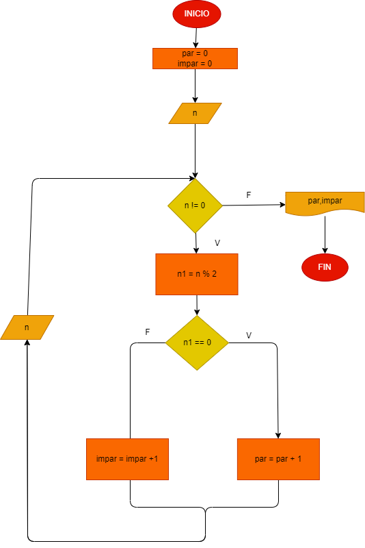

# Numeros positivos pares y impares
# Hacer el diagrama de flujo y el programa en python, que lea numeros enteros y positvos (1 cada lectura), y que averigue cuantos son pares y cuantos son impares, para terminar usaremos el registro centinela para cuando el registro ingresado sea cero

## Diagrama de flujo.

